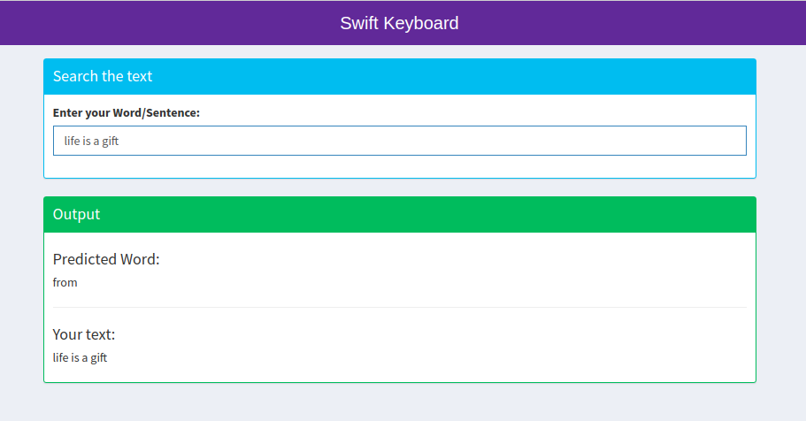

```{r setup, include=FALSE}
knitr::opts_chunk$set(echo = FALSE)
```

# Introduction

##### This Presentation will brief about Application for predicting next word.

##### This application is final capstone project as part of Datascience specialization course.

##### The goal of this project is to create a product to highlight the prediction algorithm that you have built and to provide an interface that can be accessed by others.

# Details & Process

##### The application is divided into several tasks like below:

  - Data Cleanup
  - Preparation of Prediction Model
  - Shiny App

Code for ui.R and server.R can be found on git repository
https://github.com/chandanipatel/chandani-coursera-machine-learning/tree/master/capstone-project/final-project.

Shiny Application URL: https://chandani.shinyapps.io/courseara-data-science-project-swift-key/

# Data Cleanup
All text mining and natural language processing was done with the usage of a variety of well-known R packages.

#### Dataset

The SwiftKey.zip dataset was provided by course instructor for this application.

The dataset was built on the 10% samples of three different sources (Twitter, Blogs, News).

After cleaning process it obtains the corpus which can be used to build Prediction model.

##### Following cleaning approaches has taken:

  - Convert the text in lowercase to reduce case-sensitive issues and enables to predict the word for any cases
  - Remove Numbers
  - Remove URLs
  - Remove white spaces
  - Remove stopwords
  - Remove profanity words

# Prediction Model (Generating n-grams)

Application uses the dataset of the most frequent n-grams (n=5..1), which are made of a combination of n words in the sentences.

Each n-gram was divided to key (first n-1 words in n-gram) and result word (last words in n-grams).

For each key only the most frequent n-grams was selected (if n-grams for the key have the same frequency, we choose n-gram with the most frequent result word).

The algorithm takes the last n-1 words (but not numbers, stopword, profanity words, URLs, etc.) of the last sentence (key).

# Application Details

Code for ui.R and server.R can be found on git repository.
https://github.com/chandanipatel/chandani-coursera-machine-learning/tree/master/capstone-project/final-project

Shiny Application URL: https://chandani.shinyapps.io/courseara-data-science-project-swift-key/

#### Usage of application:
- Application has 2 sections Input and outputs.
- Input section has input which takes the text and server will try to predict the next word on each character change.
- The server will update output with predicted text and entered text.

# Application Preview


# Thank You for Reading
