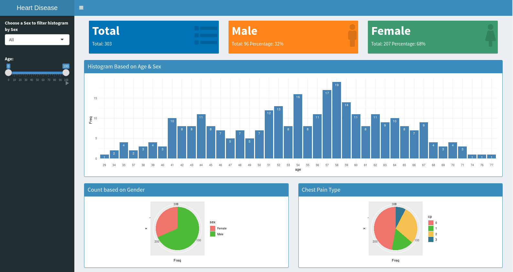

# Overview

This is a deliverable for the course Developing Data Products as part of the Coursera Data Science Specialization.

#### Instructions:

- Write a shiny application with associated supporting documentation. The documentation should be thought of as whatever a user will need to get started using your application.
- Deploy the application on Rstudio's shiny server
- Share the application link by pasting it into the provided text box
- Share your server.R and ui.R code on github

# Reproducible Pitch & Overview of Application

This presentation is created to share the assignment of Courseara Data Products.

- I have used heart disease data to show the analysis based on user inputs.
- The application sidebar panel has 2 inputs for filter data based on sex and age.
- The application has 3 types of charts, histograms of cases based on age, chest pain type and sex wise charts.

*App Source Code:* https://github.com/chandanipatel/chandani-coursera-machine-learning/tree/master/data-products/shiny-app-assignment

*App Link:* https://chandani.shinyapps.io/courseara-data-products/

# UI Codebase
```{r}
library(shiny)
library(shinydashboard)

ui <- dashboardPage(
    dashboardHeader(title = "Heart Disease Analysis"),
    dashboardSidebar(
        sidebarMenu(
            selectInput("sex", "Choose a Sex to filter histogram by Sex",
                        choices = list("All"=3, "Male"=1, "Female"=0), selected = 3),
            sliderInput("age", "Age:",
                        min = 0, max = 100, value = c(0, 100),
                        animate = animationOptions(interval = 300, loop = TRUE))
        )
    ),
    dashboardBody(
        column(width = 12,
               valueBoxOutput("totalStatestics"),
               valueBoxOutput("maleStatestics"),
               valueBoxOutput("femaleStatestics")
        ),
        # Sex wise histogram
        column(width = 12,
           box(
               title = "Histogram Based on Age & Sex", width = NULL, solidHeader = TRUE, status = "primary",
                plotOutput("sexwisePlot", height = 300)
           ),
        ),
        # Other wise histogram
        column(width = 6,
               box(
                   title = "Count based on Gender", width = NULL, solidHeader = TRUE, status = "primary",
                   plotOutput("genderPlot", height = 200)
               ),
        ),
        # Other wise histogram
        column(width = 6,
                   
                   box(
                       title = "Chest Pain Type", width = NULL, solidHeader = TRUE, status = "primary",
                       plotOutput("chestpainPlot", height = 200)
                   )
        )
    )
)
```

# Server Code

```{r}
if (!require('shiny')) install.packages("shiny")
if (!require('shinydashboard')) install.packages("shinydashboard")
if (!require('ggplot2')) install.packages("ggplot2")
library(shiny)
library(shinydashboard)
library(ggplot2)
library(scales)

server <- function(input, output) {
    heart_diease_uci <- read.csv("heart-disease-uci.csv", header = TRUE)
    
    output$minAgeSliderValue <- renderTable({
        sliderValues()
    })
    
    histogram_Sex <- reactive({
        sexFilter <- as.numeric(input$sex)
    })
    histogram_Age <- reactive({
        values <- c(min(input$age), max(input$age))
    })
    
    dataGenderwise <- reactive({
        ageFilter = histogram_Age()
        min=ageFilter[1]
        max=ageFilter[2]
        
        filter_data = heart_diease_uci[heart_diease_uci$age>min, ]
        filter_data = filter_data[filter_data$age<max, ]
        sexFilter = histogram_Sex()
        if(sexFilter != 3) {
            filter_data = filter_data[filter_data$sex == sexFilter,]
        }
        sex=filter_data$sex
        sex_wise_data=data.frame(table(unlist(sex)))
    })
    
    output$sexwisePlot <- renderPlot({
        sexFilter = histogram_Sex()
        
        ageFilter = histogram_Age()
        min=ageFilter[1]
        max=ageFilter[2]
        
        filter_data = heart_diease_uci[heart_diease_uci$age>min, ]
        filter_data = filter_data[filter_data$age<max, ]
        
        if(sexFilter == "3") {
            age=filter_data$age
        } else {
            age=filter_data[filter_data$sex == sexFilter,]['age']
        }
        sex_wise_data=data.frame(table(unlist(age)))
        colnames(sex_wise_data)[1]<-'age'
        ggplot(data=sex_wise_data, aes(x=age, y=Freq)) +
            geom_bar(stat="identity", fill="steelblue") +
            theme_minimal()+
            geom_text(aes(label=Freq), vjust=1.6, color="white", size=3.5)
    })
    
    output$genderPlot <- renderPlot({
        ageFilter = histogram_Age()
        min=ageFilter[1]
        max=ageFilter[2]
        
        filter_data = heart_diease_uci[heart_diease_uci$age>min, ]
        filter_data = filter_data[filter_data$age<max, ]
        sexFilter = histogram_Sex()
        if(sexFilter != 3) {
            filter_data = filter_data[filter_data$sex == sexFilter,]
        }
        sex=filter_data$sex
        sex_wise_data=data.frame(table(unlist(sex)))
        colnames(sex_wise_data)[1]<-'sex'
        sex_wise_data$sex <- with(sex_wise_data, ifelse(sex==1, 'Male', "Female"))
        
        ggplot(sex_wise_data, aes(x="", y=Freq, fill=sex)) +
            geom_bar(stat="identity", width=1) +
            coord_polar("y", start=0) +
            scale_fill_manual(values=c("#EF746C", "#4DBB37"))
    })
    
    output$chestpainPlot <- renderPlot({
        ageFilter = histogram_Age()
        min=ageFilter[1]
        max=ageFilter[2]
        
        filter_data = heart_diease_uci[heart_diease_uci$age>min, ]
        filter_data = filter_data[filter_data$age<max, ]
        
        sexFilter = histogram_Sex()
        if(sexFilter != 3) {
            filter_data = filter_data[filter_data$sex == sexFilter,]
        }
        
        cp=filter_data$cp
        cp_wise_data=data.frame(table(unlist(cp)))
        colnames(cp_wise_data)[1]<-'cp'
        
        ggplot(cp_wise_data, aes(x="", y=Freq, fill=cp)) +
            geom_bar(stat="identity", width=1) +
            coord_polar("y", start=0) +
            scale_fill_manual(values=c("#EF746C", "#4DBB37", "#F4C050", "#327791"))
    })
    
    output$maleStatestics <- renderValueBox({
        sex_wise_data = dataGenderwise()
        male = sex_wise_data$Freq[1]
        total = sum(sex_wise_data$Freq)
        malepercent = percent(male/total)
                valueBox(
            "Male", paste0("Total: ", male, " Percentage: ", malepercent), icon = icon("male"),
            color = "orange"
        )
    })
    
    output$femaleStatestics <- renderValueBox({
        sex_wise_data = dataGenderwise()
        print(sex_wise_data)
        total = sum(sex_wise_data$Freq)
        female = sex_wise_data$Freq[2]
        femalepercent = percent(female/total)
        
        valueBox(
            "Female", paste0("Total: ", female, " Percentage: ", femalepercent), icon = icon("female"),
            color = "olive"
        )
    })
    
    output$totalStatestics <- renderValueBox({
        sex_wise_data = dataGenderwise()
        
        total = sum(sex_wise_data['Freq'])
        text
        valueBox(
            "Total", paste0("Total: ", total), icon = icon("list"),
            color="blue"
        )
    })
}

```

# Application Preview
